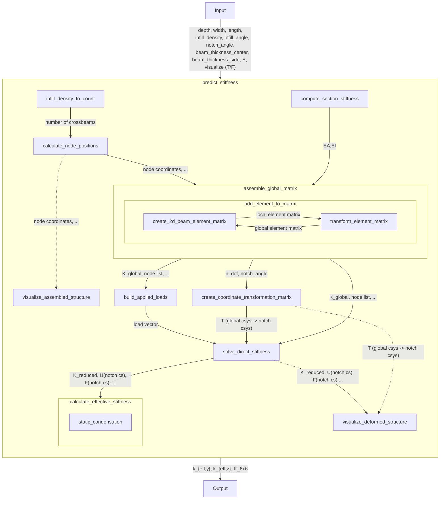

# PredictStiffness_MasterThesis
Python code for the Master's Thesis "Analytical Modeling and Analysis of Structured Compliant Grippers for High-Speed Assembly Tasks"

Gripper_Analysis.py includes most of the calculations (Geometry and node generation, Direct Stiffness Method functions) as well as the visualization functions, stiffness_model.py processes the inputs and combines the functions from Gripper_Analysis.py to obtain the global stiffness matrix for the gripper. It then takes the global stiffness matrix and condenses and assembles it into the relevant outputs (k_eff,y and k_eff,z, K_eff).

The most important function is the predict_stiffness function inside stiffness_model.py that allows to predict the stiffness based on the parameter inputs. It also includes the option to visualize the deformation. The visualize_stiffness_matrix function can be commented out in the code if not needed.

An example use case of PySR is included. The script performs symbolic regression to derive interpretable approximation functions for stiffness as a function of infill angle and infill density. The resulting candidate equations are saved in PySR_hall_of_fame.csv.

The reported functions are normalized by $(E \cdot d)$. To obtain the actual predicted stiffness values, the function output must be multiplied by $(E \cdot d)$.

